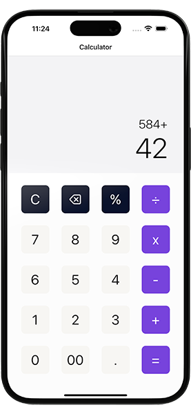

# React Native Calculator App

This is an [Expo](https://expo.dev) project created with [`create-expo-app`](https://www.npmjs.com/package/create-expo-app) to create a simple calculator app in react native.

## Get started

1. Install dependencies

   ```bash
   npm install
   ```

2. Start the app

   ```bash
    npx expo start
   ```

## App Screenshot


## Watch it on YouTube

This repository is part of a tutorial on my [YouTube channel](https://www.youtube.com/@itzpradip). Check out the complete tutorial on YouTube by clicking below. 👇

[](https://youtu.be/JqSPeqKuHNE)